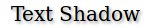

# Texto

Las nuevas propiedades de CSS3 para dar formato a textos son:

* **text-shadow**: Permite dar sombra a un texto. Sus propiedades son distancia horizontal, distancia vertical, desenfoque (_blur_) y color de la sombra. Por ejemplo:

```css
text-shadow: 2px 2px 2px #9e9e9e;
filter: dropshadow(color=#9e9e9e, offx=2, offy=2);
```

Con lo que obtendríamos un resultado similar a:




* **word-wrap: break-word;** - Permite separar palabras muy largas dentro de un elemento de bloque. Por defecto toma el valor "normal", por lo que las palabras largas se saldrían del borde del elemento. Con el valor "break-word" indicamos que las palabras pueden ser partidas para que quepan en el ancho de la caja, de la forma:


* **text-overflow: clip | ellipsis;** - Indica la forma de partir texto cuando excede el tamaño de su contenedor. Con "clip" el texto sobrante será cortado directamente aunque se quede una palabra por la mitad, mientras que "ellipsis" quitará la última palabra que no quepa y pondrá en su lugar unos puntos suspensivos. Esta propiedad de momento no funciona en Firefox.


* **font-face**: Permite utilizar tipografías diferentes a las estándar, que serán importadas desde un fichero indicado. De momento soporta los formatos: .eot, .ttf y .otf. Para importar una fuente hay que seguir la siguiente sintaxis:


```css
@font-face{
   font-family: <nombre-fuente>;
   src: <source>;
   [font-weight: <weigth>];
   [font-style: <style>];
}
```

Con "font-family" indicamos el nombre que le damos a la fuente, y "src" nos permite seleccionar el fichero a cargar. Los otros dos parámetros son opcionales y tendrán valor "normal" por defecto. Por ejemplo:


```css
@font-face {
   font-family: ’LeagueGothic’;
   src: url(LeagueGothic.otf);
}

// Ahora ya podemos usar esta fuente:
p {
   font-family: ’LeagueGothic’;
}
```
