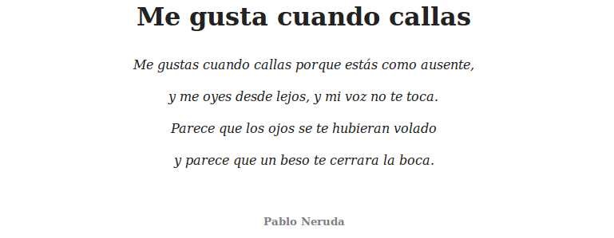

## Estilos para párrafos

Los estilos para párrafos nos permiten cambiar propiedades de todo un párrafo o bloque de texto, como por ejemplo el espaciado entre las líneas, la alineación, etc.

* **line-height:** normal | unidades CSS <br/>
*Ejemplos*: line-height: 12px; line-height: normal; <br/>
El alto de una línea, y por tanto, el espaciado entre líneas. Es una de esas características que no se podían modificar utilizando HTML.

* **text-align:** left | right | center | justify <br/>
*Ejemplos*: text-align: right; text-align: center;<br/>
Sirve para indicar la alineación del texto. Es interesante destacar que las hojas de estilo permiten el justificado de texto, aunque recuerda que no tiene por que funcionar en todos los sistemas.

* **text-indent:** Unidades CSS<br/>
*Ejemplos*: text-indent: 10px; text-indent: 2in; <br/>
Un atributo que sirve para hacer sangrado o márgenes en las páginas.


## Ejemplos

Para alinear el texto de un párrafo a la derecha podemos utilizar: 

```html
<p style="text-align:right">
    Texto alineado a la derecha
</p>
```


En este otro ejemplo vamos a colocar un texto centrado, con un interlineado mayor, con el texto en cursiva y gris. Además definiremos la hoja de estilo en la cabecera de la página: 

```html
<!DOCTYPE HTML PUBLIC "-//W3C//DTD HTML 4.01//EN" "http://www.w3.org/TR/html4/strict.dtd">
<html>
<head>
    <title>Ejemplo</title>
    <meta charset="utf-8"/>
    <style type="text/css">
        h1 {
            color: #222;
            text-align: center;
        }
        .poema {
            text-align: center;
            font-style:italic; 
            line-height: 30pt;
            font-size: 12pt;
            color: #222;
        }
        .autor {
            font-weight:bold; 
            color:gray;
            font-size: 10pt;
            text-align: center;
        }
    </style>
</head>
<body>
    <h1>Me gusta cuando callas</h1>
    <p class="poema">
        Me gustas cuando callas porque estás como ausente, <br/>
        y me oyes desde lejos, y mi voz no te toca. <br/>
        Parece que los ojos se te hubieran volado <br/>
        y parece que un beso te cerrara la boca.
    </p>
    <br/>
    <p class="autor">
        Pablo Neruda
    </p>
</body>
</html>
```

Con lo que obtendríamos un resultado similar al siguiente:



