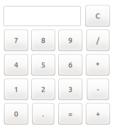
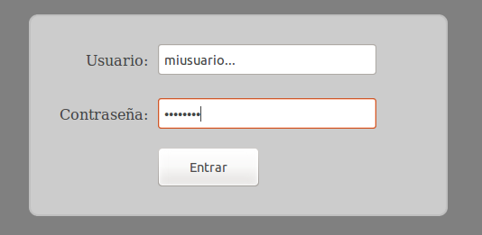
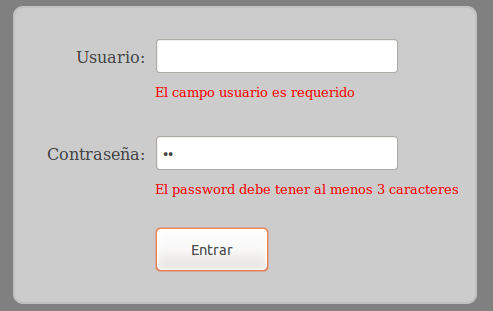

# Ejercicios 2 - Ejercicios sobre JavaScript

## Ejercicio 1 - Calculadora sencilla (1 punto)

Para practicar con javascript vamos a crear una calculadora sencilla como la que se muestra en el siguiente esquema:


Para ellos seguiremos los pasos:

* En primer lugar escribiremos el código HTML para diseñar una calculadora como la que se muestra en el esquema de la imagen. Es importante que asignemos un identificador único a los campos tipo "`input`" de entrada de datos y al campo en el que se mostrará el resultado (para este campo podemos asignar un identificador a una etiqueta `span` vacía).
* Crearemos una función para cada operación que se llamará en el evento "`onclick`" de cada botón.
* Las funciones deben comprobar que se haya escrito algún valor en los campos y en caso de error mostrar un aviso. Además, en la función de división se deberá de comprobar que el resultado sea correcto (finito) y en caso de error se mostará también un mensaje.

> Para obtener o asignar valor a los campos tipo `input` usaremos su propiedad `.value`, mientrar que para asignar un valor a otro tipo de elementos HTML (como párrafos (p), cajas (div), span, etc.) utilizaremos su propiedad `.innerHTML`.

> Al obtener el valor de un `input` se obtiene con tipo cadena, para realizar las operaciones correctamente tendréis que convertirlo a decimal mediante la función `parseFloat(valor)`.


## Ejercicio 2 - Calculadora avanzada (1 punto)

En este ejercicio vamos a crear una calculadora un poco más avanzada que la del ejercicio anterior. En primer lugar escribiremos el código HTML para crear una calculadora con un diseño similar al de la siguiente figura:



Nos podemos ayudar de una tabla de HTML para la disposición de los elementos. La pantalla de la calculadora será un campo DIV al cual asignaremos valores mediante la función `.innerHTML`.

El código JavaScript constará de 3 funciones:

* Una función "`limpiar()`" que se llamará al pulsar la tecla "C" y que borrará el contenido de la pantalla.
* Una función "`setValue(valor)`" que añadirá el valor pasado por parámetro al contenido ya existente en la pantalla. Esta función se utilizará tanto para añadir números (`setValue(2)`) como para añadir las operaciones (`setValue('+')`) y el separador decimal (`setValue('.')`).
* Una función "`calcular()`" que calculará la operación introducida en la pantalla y mostrará el resultado de la misma. Para realizar los cálculos haremos uso de la función de javascript `eval`, la cual evalua la expresión que recibe por parámetro y devuelve el resultado. Además, dado que la expresión puede contener errores es necesario introducirla en un bloque `try...catch` como el siguiente:

```javascript
try {
    pantalla.innerHTML = eval( expr );
} catch (e) {
    // error
}
```

Notas:
* Es necesario controlar los siguientes errores:
  * Cuando se llame a "`calcular()`" y no haya nada introducido en la pantalla.
  * Si se produce una excepción al evaluar la expresión.
  * Si el resultado de la operación no es un número o no es finito.
* En caso de error se mostrará el aviso "ERROR" por la pantalla.
* Después de un error, si se pulsa limpiar o se introduce un valor se borrará el aviso.


## Ejercicio 3 - Validación de un formulario (1 punto)

En este último ejercicio vamos a crear un formulario para el acceso a la sección privada de una web mediante usuario y contraseña, esto nos valdrá para practicar con la funcionalidad de javascript validando sus campos.

En primer lugar crearemos el HTML del formulario de login, el cual deberá ser similar al de la siguiente imagen:



* El fondo de la web tendrá el color "_gray_".
* La caja contenedora tendrá un ancho de 400px y estará centrada en la pantalla. Su color de fondo será #ccc y tendrá un _border_ de 2px de color _silver_. Además tendrá un espaciado interior de 30px.
* Se tendrá que adaptar también el resto de elementos para que se muestren con un aspecto y disposición similar al de la figura.

Se aconseja crear una sección de estilos CSS para agrupar los estilos del formulario.

A continuación crearemos una función de JavaScript para realizar la validación del formulario, la cual mostará los errores que hubiera o indicará que se ha validado correctamente. Para incluir los mensajes de error se pueden incluir directamente en el HTML inicial del formulario, pero se marcarán como ocultos usando la propiedad CSS: `display:none` y cuando se quierdan mostrar se cambiará a `display:block`.

> Nota: para cambiar el estilo de un campo en JavaScript se puede hacer accediendo a su propiedad `style` de la forma: `campo.style.display = 'block';`

Al pulsar sobre el botón "Entrar" se llamará a una función "`validar()`" que realizará las siguientes acciones:

* Si alguno de los campos está vacío mostrará un mensaje de error indicándolo.
* Si el campo no está vacío pero la longitud es inferior a 3 caracteres también se mostará un error indicándolo (ver la imagen inferior).
* Si no se produce ningún error aparecerá el aviso: "¡Validación correcta!



Notas:
* Si se pulsa varias veces el botón "Entrar" hay que actualizar los errores: si un error anterior ya no se produce el aviso tendrá que desaparecer.
* Solo se podrá mostrar un mensaje de error por cada campo: campo requerido o longitud mínima incorrecta.


