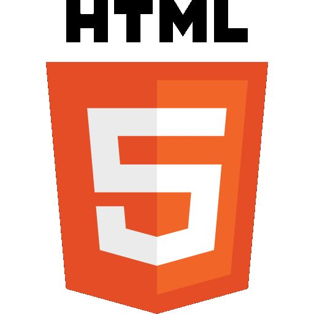

# Introducción a HTML 5

La quinta revisión del lenguaje de programación HTML pretende remplazar al actual (X)HTML, corrigiendo problemas con los que los desarrolladores web se encuentran, así como rediseñar el código y actualizándolo a nuevas necesidades que demanda la web de hoy en día.

Actualmente se encuentra en modo experimental, lo cual indica la misma W3C; aunque ya es usado por múltiples desarrolladores web por sus avances, mejoras y ventajas.

A diferencia de otras versiones de HTML, los cambios en HTML5 comienzan añadiendo semántica y accesibilidad implícitas. Establece una serie de nuevos elementos y atributos que reflejan el uso típico de los sitios web modernos. Algunos de ellos son técnicamente similares a las etiquetas `
` y ``, pero tienen un significado semántico, como por ejemplo `<nav>` (bloque de navegación del sitio web) o `<footer>`. Otros elementos proporcionan nuevas funcionalidades a través de una interfaz estandarizada, como los elementos `<audio>` y `<video>`.

Algunos elementos de HTML 4.01 han quedado obsoletos, incluyendo elementos puramente de presentación, como `` y `
`, cuyos efectos se deben de realizar utilizando CSS. También hay un renovado énfasis en la importancia del scripting DOM para el comportamiento de la web.

