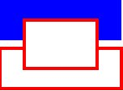

# Canvas

El elemento canvas puede definirse como un entorno para crear imágenes dinámicas. Utilizando su API en JavaScript podemos manipular el elemento canvas para dibujar en él y crear gráficos dinámicos de todo tipo (incluidas interfaces de aplicaciones web completas). La API, aunque de momento está en desarrollo, la podemos encontrar en: <a href="http://www.whatwg.org/specs/web-apps/current-work/multipage/the-canvas-element.html">http://www.whatwg.org/specs/web-apps/current-work/multipage/the-canvas-element.html</a>

Para empezar a usarlo lo único que hay que especificar son sus dimensiones. El texto que escribamos entre la apertura y cierre de la etiqueta canvas solamente será interpretado por navegadores que no soporten esta etiqueta:


```html
<canvas id="myCanvas" width="360" height="240">
   <p>Tu navegador no soporta canvas</p>
</canvas>
```

El resto de trabajo con canvas se ha de realizar con código JavaScript. Primero debemos referenciar este elemento y adquirir su contexto (que de momento solo está disponible para 2D):


```javascript
var canvas = document.getElementById(’myCanvas’);
var context = canvas.getContext(’2d’);
```

Una vez adquirimos el contexto podemos empezar a dibujar. La API bidimensional ofrece muchas de las herramientas que podemos encontrar en cualquier aplicación de diseño gráfico: trazos, rellenos, gradientes, sombras, formas y curvas Bézier. Los principales métodos disponibles son:

* **fillRect(x, y, width, height)**: dibuja un rectángulo relleno de color según el estilo activado.
* **strokeRect(x, y, width, height)**: dibuja solo el borde de un rectángulo, el interior será transparente.
* **clearRect(x, y, width, height)**: borra el área indicada.
* **beginPath()**: inicializa el dibujado de un "trazo".
* **closePath()**: cierra la figura creando una línea desde el último punto hasta el primero.
* **moveTo(x, y)**: mueve el puntero del trazo hasta las coordenadas indicadas (para poder seguir dibujando).
* **lineTo(x, y)**: dibuja un trazo desde la posición actual hasta las coordenadas indicadas.
* **stroke()**: dibuja el trazo indicado desde el último "beginPath()".
* **fill()**: cierra el trazo definido desde el último "beginPath()" y lo rellena.
* **arc(x, y, radius, startAngle, endAngle, anticlockwise)**: dibuja un arco con centro en "x, y" y el radio definido. Los ángulos se definen en radianes (radianes = (PI/180)*grados) y el último parámetro es un valor booleano.
* **quadraticCurveTo(controlx, controly, x, y)**: dibuja una curva de bezier cuadrática.
* **bezierCurveTo( control1x, control1y, control2x, control2y, x, y)**: dibuja una curva de bezier cúbica.
* **drawImage(x, y)**: dibuja una imagen (como objeto JavaScript) en el canvas.
* **createImageData(width, height)**:** **crea un objeto ImageData como un array de píxeles para ser manipulado como un array de enteros.
* **getImageData(x, y, w, h)**: carga un objeto ImageData a partir del dibujo actual para ser manipulado.
* **putImageData(imageData, x, y)**: mapea los valores de un objeto ImageData en el dibujo actual.
* **strokeText(string, x, y)**: dibuja una cadena de texto usando solo su borde.
* **fillText(string, x, y)**: dibuja una cadena de texto.


A continuación mostramos un ejemplo de dibujado en un objeto canvas una vez capturado su contexto:


```javascript
// Primero definimos las propiedades con las que vamos a dibujar
context.fillStyle   = ’#0000ff’; // color de relleno azul
context.strokeStyle = ’#ff0000’; // color de borde rojo
context.lineWidth   = 4;         // grosor de línea

// Y a continuación dibujar algunas figuras
context.fillRect  (0,   0, 150, 50);   // rectángulo relleno
context.strokeRect(0,  60, 150, 50);   // rectángulo solo borde
context.clearRect (30, 25,  90, 60);   // borrar área del canvas
context.strokeRect(30, 25,  90, 60);   // Orden de coordenadas: izqda, arriba, ancho, largo
```


Obteniendo finalmente un resultado similar a:




Webs muy importantes están cambiando sus contenidos a canvas y dejando de usar Flash, como Slideshare (ver <a href="http://www.slideshare.net/AmitRanjan/slideshare-is-html5-now">http://www.slideshare.net/AmitRanjan/slideshare-is-html5-now</a>).

