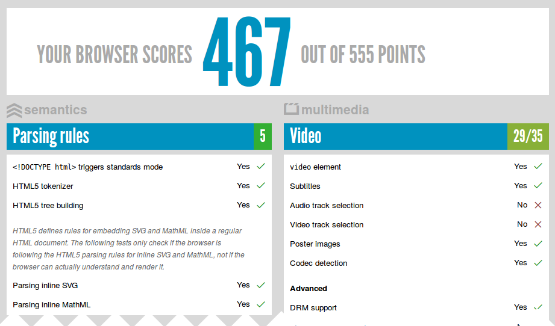

# Navegadores que lo soportan

Actualmente, de los navegadores de escritorio, el que mayor soporte da es Google Chrome, seguido muy de cerca por Mozilla Firefox y Apple Safari. El que menor compatibilidad ofrece es Internet Explorer.

Para comprobar la compatibilidad de un navegador podemos visitar la Web "<a href="http://www.html5test.com/">http://www.html5test.com/</a>" donde se realiza un test de todas las funcionalidades de HTML5.

