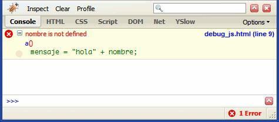

# Detección de errores con Firefox y Chrome

Firefox y Chrome proporcionan herramientas para ayuda al desarrollador que están incluidas por defecto y que son de gran utilidad a la hora de depurar y detectar errores en una web en desarrollo.

Para abrir estas utilidades se puede pulsar sobre la opción correspondiente del menú (en la sección "Herramientas") o directamente pulsando la tecla de función F12.

La consola de errores permite diferenciar los mensajes de información, los mensajes de aviso y los mensajes de error. Además, permite visualizar todos los errores de la página simultáneamente. Por cada error detectado se indica la posible solución mediante un mensaje en inglés y se muestra el trozo de código del script donde se ha producido el error. Además, pulsando sobre el enlace incluido se accede a la línea concreta del archivo concreto donde se ha
producido el error.

Firefox permite instalar pequeñas mejoras y ampliaciones en el navegador, que se
conocen con el nombre de extensiones. Una de las extensiones más interesantes para los desarrolladores de aplicaciones web es Firebug, que se puede descargar gratuitamente desde http://www.getfirebug.com/

