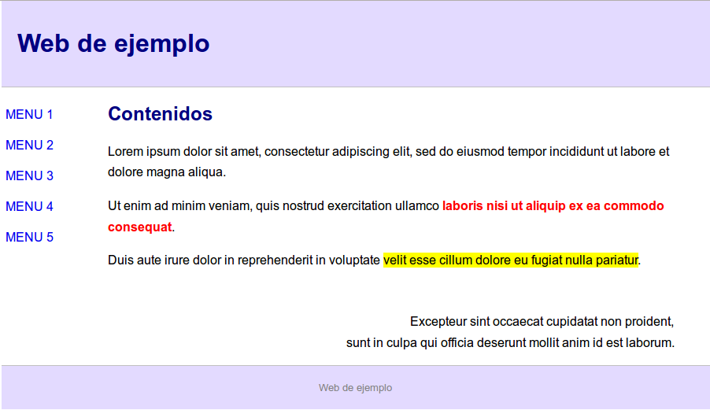

# Ejemplo

En esta sección se incluye un ejemplo más completo de una pequeña página web HTML a la que se le han aplicado estilos definidos en una sección _style_ interna además de algunos estilos _inline_. 

En la siguiente imagen se incluye una captura de la apariencia final del código de ejemplo. Como se puede ver la web consta de una cabecera, un menú lateral, una sección principal de contenido y un pie de página: 




A continuación se incluye el código HTML y CSS utilizado para componer la web de ejemplo. En primer lugar, en la sección de cabecera (`head`), se ha incluido una sección de estilos entre las etiquetas `style`. En la sección `body` se incluye todo el código HTML que define la página con los estilos aplicados: 


```html
<!DOCTYPE HTML PUBLIC "-//W3C//DTD HTML 4.01//EN" "http://www.w3.org/TR/html4/strict.dtd">
<head>
	<title>Ejemplo</title>
	<style type="text/css">
		body { /* Redefinimos la etiqueta body */
			padding: 0px;
			margin: 0px;
			font-family: arial, helvetica;
			width: 900px;
			margin: 0 auto; 
		}
		h1, h2 { /* Redefinimos las etiquetas de cabecera */
			color: navy;
		}
		#header { /* Estilo para la cabecera usando su identificador */
			padding: 15px 20px;
			background-color: #E3DAFF;
			border-bottom: 1px solid silver; 
		}
		#sidebar {
			float: left;
			width: 15%;
		}
		#article {
			float: left;
			width: 80%;
		}
		#footer {
			clear: both; 
			text-align: center;
			border-top: 1px solid silver; 
			font-size: small;
			color: gray;
			background-color: #E3DAFF;
			padding: 20px;
		}
		#sidebar a { /* Estilo para los enlaces de la barra lateral */
			text-transform: uppercase;
			text-decoration: none;
			padding: 10px 5px; 
			display: block; 
		}
		#sidebar a:hover { /* Pseudo-clase para los enlaces */
			background-color: navy;
			color: white; 
		}
		#article p {
			line-height: 20pt;
		}
		.nota { /* Definimos la clase .nota */
			background-color: yellow;
		}
		.alineado-derecha { /* Definimos la clase .alineado-derecha */
			text-align: right;
		}
	</style>
</head>
<body>
	<div id="header">
		<h1>Web de ejemplo</h1>
	</div>
	<div id="content">
	
		<div id="sidebar" style="padding-top: 15px">			
			<a href="#">Menu 1</a>
			<a href="#">Menu 2</a>
			<a href="#">Menu 3</a>
			<a href="#">Menu 4</a>
			<a href="#">Menu 5</a>
		</div>
		<div id="article">
		
			<h2>Contenidos</h2>
		
			<p>
				Lorem ipsum dolor sit amet, consectetur adipiscing elit, sed do eiusmod 
				tempor incididunt ut labore et dolore magna aliqua.
			</p>
			<p>
				Ut enim ad minim veniam, quis nostrud exercitation ullamco 
				<span style="font-weight:bold; color:red">laboris nisi ut aliquip ex ea 
				commodo consequat</span>.
			</p>
			<p>
				Duis aute irure dolor in reprehenderit in voluptate 
				<span class="nota">velit esse cillum dolore eu fugiat nulla pariatur</span>.
			</p>
			<br/>
			<p class="alineado-derecha">
				Excepteur sint occaecat cupidatat non proident, 
				<br/>
				sunt in culpa qui officia deserunt mollit anim id est laborum.
			</p>			
		
		</div>	
	</div>
	<div id="footer">
		Web de ejemplo
	</div>
</body>
</html>
```