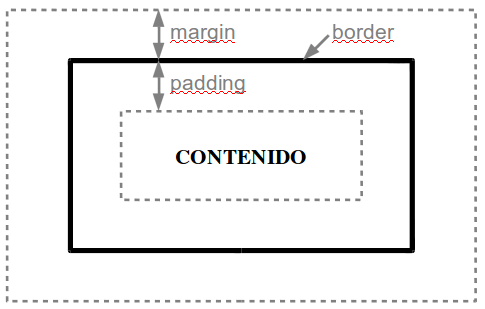

## Estilos para cajas 

(`
` o `<table>`)

* **width:** Unidades CSS | Porcentaje 
**height:** Unidades CSS | Porcentaje 
*Ejemplos*: width: 50px; width: 100%; height: 15px; 
Permiten indicar el ancho y altura de un elemento. Se pueden aplicar sobre muchos elementos, como tablas, etiquetas div, imágenes, párrafos "p", etc. Con algunas etiquetas no funciona, tampoco sirve para indicar espaciado (padding), bordes o márgenes.

* **margin-left:** Unidades CSS  
*Ejemplos*: margin-left: 1cm; margin-left: 0,5in;  
Indica el tamaño del margen izquierdo.

* **margin-right:** Unidades CSS 
*Ejemplos*: margin-right: 5%; margin-right: 1in;  
Define el tamaño del margen derecho.

* **margin-top:** Unidades CSS  
*Ejemplos*: margin-top: 0px; margin-top: 10px;  
Indica el tamaño del margen superior.

* **margin-bottom:** Unidades CSS  
*Ejemplos*: margin-bottom: 0pt; margin-top: 1px;  
Indica el tamaño del margen inferior.

* **margin:** `<arriba> <derecha> <abajo> <izquierda>` | `<arriba> <derecha> <abajo>` | `<arriba-abajo> <izquierda-derecha>` | `<los 4 márgenes>` 
*Ejemplos*: margin: 4px 2px 1px 2px; margin: 4px; 
También podemos utilizar el estilo "margin" para indicar todos los márgenes a la vez, esta etiqueta nos permite indicarle desde 4 valores (para cada uno de los márgenes), hasta 1 valor (para aplicarlo sobre todos los márgenes).

* **padding-left:** Unidades CSS  
*Ejemplos*: padding-left: 0.5in; padding-left: 1px;  
Indica el espacio insertado, por la izquierda, entre el borde del elemento-continente y el contenido de este. Es parecido a el atributo cellpadding de las tablas. El espacio insertado tiene el mismo fondo que el fondo del elemento-continente.

* **padding-right:** Unidades CSS  
*Ejemplos*: padding-right: 0.5cm; padding-right: 1pt;  
Indica el espacio insertado, en este caso por la derecha, entre el borde del elemento-continente y el contenido de este. Es parecido a el atributo cellpadding de las tablas. El espacio insertado tiene el mismo fondo que el fondo del elemento-continente.

* **padding-top:** Unidades CSS  
*Ejemplos*: padding-top: 10pt; padding-top: 5px;  
Indica el espacio insertado, por arriba, entre el borde del elemento-continente y el contenido de este.

* **padding-bottom:** Unidades CSS  
*Ejemplos*: padding-bottom: 0.5cm; padding-bottom: 1pt;  
Indica el espacio insertado, en este caso por abajo, entre el borde del elemento-continente y el contenido de este.

* **padding:** `<arriba> <derecha> <abajo> <izquierda>` | `<arriba> <derecha> <abajo>` | `<arriba-abajo> <izquierda-derecha>` | `<los 4 márgenes>` 
*Ejemplos*: padding: 4px 2px 1px 2px; padding: 4px; 
Al igual que para "margin", esta etiqueta nos permite indicarle desde 4 valores (espaciado hasta cada uno de los bordes por separado), hasta 1 valor (para indicar el mismo espaciado hasta todos los bordes).

* **border-color:** color RGB o nombre de color  
*Ejemplos*: border-color: red; border-color: #ffccff;  
Para indicar el color del borde del elemento de la página al que se lo aplicamos. Se puede poner colores por separado con los atributos border-top-color, border-right-color, border-bottom-color, border-left-color.

* **border-style:** none | dotted | solid | double | groove | ridge | inset | outset  
*Ejemplos*: border-style: solid; border-style: double;  
El estilo del borde, los valores significan: none=ningún borde, dotted=punteado, solid=solido, double=doble borde, desde groove hasta outset son bordes con varios efectos 3D.

* **border-width:** Unidades CSS  
*Ejemplos*: border-width: 10px; border-width: 0.5in;  
El tamaño del borde del elemento al que lo aplicamos.

* **border:** `<grosor> <tipo> <color>` 
*Ejemplo*: border: 2px solid red; 
De esta forma podemos indicar las tres propiedades del borde a la vez. También podemos utilizar border-top, border-right, border-bottom y border-left para indicar estas tres propiedades para un borde en concreto.

* **float:** none | left | right  
*Ejemplo*: float: right;  
Sirve para alinear un elemento a la izquierda o la derecha haciendo que el texto se agrupe alrededor de dicho elemento.

* **clear:** none | both | right | left  
*Ejemplo*: clear: right;  
Indica que no se permiten elementos por ese lado del objeto. Por ejemplo, si tenemos varias cajas una a continuación de otra, al poner "clear:left" en la última caja, esta pasaría a la siguiente línea.

En la siguiente imagen se puede ver un esquema de un contenedor _DIV_ en el que se representa la diferencia entre _margin_, _padding_ y _border_:

