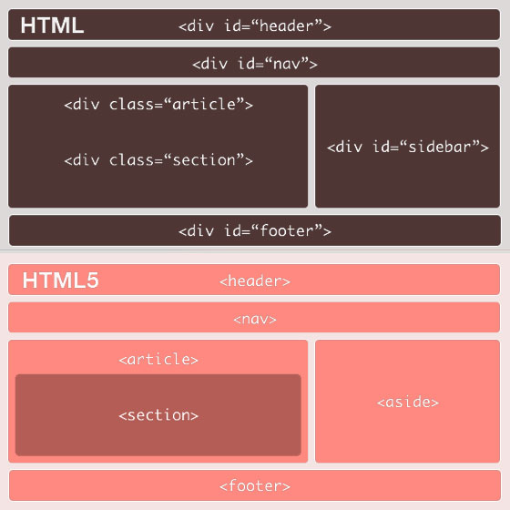

# Estructura semántica

Hasta ahora se utilizaba de forma abusiva la etiqueta `<div>` y las tablas para estructurar una web en bloques. El HTML5 nos brinda nuevas etiquetas que perfeccionan esta estructuración. Estas nuevas etiquetas introducen un nuevo nivel semántico que hace que la estructura de la web sea más coherente y fácil de entender. Además los navegadores podrán darle más importancia a determinadas secciones, facilitándole además la tarea a los buscadores, así como cualquier otra aplicación que interprete sitios Web. En la siguiente imagen se puede ver una comparación entre la estructuración realizada con HTML (hasta la versión 4) y HTML 5:




Las Webs se dividirán en los siguientes elementos:

* `<section></section>`: Se utiliza para representar una sección “general” dentro de un documento o aplicación, como un capítulo de un libro. Puede contener subsecciones y si lo acompañamos de las etiquetas `<h1>..<h6>` podemos estructurar mejor toda la página creando jerarquías del contenido, algo muy favorable para el buen posicionamiento web. Por ejemplo:

```html
<section>
   <h1>Introducción al elemento section</h1>
   <p>El elemento section se usa para agrupar
   contenido relacionado entre si.</p>
   <p>...</p>
</section>
```

* `<article></article>`: Se usa para definir contenido autónomo e independiente, con la intención de ser reutilizable de modo aislado. El elemento article puede contener uno o varios elementos section. Si por ejemplo nuestro contenido puede ser redistribuido como RSS y sigue manteniendo íntegro su significado, entonces, probablemente es un elemento article. De hecho, el elemento article está especialmente indicado para sindicación. El elemento article es especialmente útil para posts en blogs, noticias en prensa digital, comentarios y posts en foros.<br/>
La especificación de HTML5 añade además que el elemento article debe ser usado por widgets autónomos como; calculadoras, relojes, marcos de clima y cosas por el estilo. Hay que analizar si el contenido de un widget es autónomo, independiente y puede ser reutilizable o incluso sindicado.


* `<aside></aside>`: Representa una sección de la página que abarca un contenido no directamente relacionado con el contenido que lo rodea, por lo que se le puede considerar un contenido independiente. Dentro de este elemento pueden incluirse: elementos publicitarios, barras laterales, grupos de elementos de la navegación, efectos tipográficos, u otro contenido que se considere separado del contenido principal de la página.

* `<header></header>`: Es la cabecera de la página o de una sección. Existe una diferencia clave entre el elemento header y el uso habitual del término header (o cabecera) utilizado comúnmente para situar los elementos del encabezado de un sitio web.<br/>
Una página web debe definir un header principal donde normalmente irá el logo o el nombre del sitio y seguramente un menú de navegación, pero además puede —y debe— definir otros elementos `<header>` dentro de los elementos `<section>`:


```html
<section>
   <header>
      <h1>Cabecera se sección</h1>
   </header>
   <p>...</p>
</section>
```


* `<nav></nav>`: Contiene información sobre la navegación por el sitio web, usualmente una lista de enlaces. Este elemento debe de ser utilizado solo para la navegación principal del sitio y no para enlaces externos por ejemplo. Normalmente el elemento nav aparece dentro de un elemento _header_ o _footer_.

* `<footer></footer>`: Representa el pié de una sección o la parte inferior de una página Web, contiene información acerca de la página/sección que poco tiene que ver con el contenido de la página, como el autor, el copyright, la fecha de última modificación, etc. Igual que con la etiqueta `<header>`, este elemento también se puede utilizar dentro de una sección para indicar información como: quien lo ha escrito, información de propiedad intelectual, enlaces, etc.

Es muy importante tener en cuenta que estas etiquetas no indican su posición en la página Web, sino su valor semántico. Por ejemplo, las etiquetas _header, footer o aside_ no indican que esos elementos tengan que ir en la parte superior, inferior o lateral del contenido principal, sino que indican su función en esa sección o en esa página.


Además debemos tener en cuenta que estas nuevas etiquetas se comportan igual que una etiqueta de caja `<div>` por lo que podemos aplicarles los mismos estilos CSS. Podemos redefinir la propia etiqueta o aplicarle una clase, por ejemplo:


```css
header { width: 100%; padding: 10px; margin-bottom: 20px; }
.webheader { height: 30px; border: 1px solid gray; background-color: silver; }
.sectionheader { font-size: 20px; }
```
