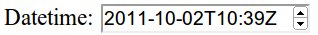

# Formularios

La estructura de los formularios con HTML 5 no varía con respecto a las anteriores de HTML. Pero sí que se añaden muchos nuevos tipos de campos que podemos utilizar, cada uno específico para cada tipo de dato.

En el caso de que utilicemos estas características y el navegador no sea compatible, simplemente las ignorará sin causarnos mayores problemas. También podemos detectar si el navegador soporta una determinada característica y en caso negativo emularla mediante código JavaScript (para más información ver la sección "Detectar funcionalidades de HTML5").

Los nuevos tipos de campos son:


* **search**: se utiliza para crear cajas de búsqueda. Tiene un aspecto similar a un campo de tipo texto. Además podemos utilizar el atributo _results="num"_ para añadir un histórico de búsquedas con "num" resultados. De momento no funciona ni en Firefox ni en Chrome.


```html
<label for="busqueda">Búsqueda con histórico: </label>
<input type="search" name="busqueda" id="busqueda" results="5"/>
```


* **number**: campo numérico, incorpora dos botones para para incrementar o decrementar el valor del campo. Además podemos usar atributos para asignar restricciones, como _min=""_, _max=""_ o _step=""_. El valor es almacenado en el atributo _value=""_.

   


* **range**: campo numérico que permite seleccionar mediante una barra de desplazamiento un valor entre dos valores predeterminados, especificados mediante min="" y max="". El valor actual es almacenado en el atributo _value=""_. Además podemos indicar el incremento mínimo al desplazar la barra con _step=""_.

   


* **color**: permite seleccionar un color. De momento solo funciona en Opera 11.

* **tel**: es un campo de texto normal pero valida si el valor introducido es un número telefónico (todavía no funciona).

* **url**: valida direcciones web. De momento requiere "http://" o "http:" simplemente. En algunos navegadores cambia el aspecto del cambio.

* **email**: valida direcciones de email. Funciona en algunos navegadores, mostrando además un aspecto diferenciado. Para iPhone además adapta el teclado.

* **date**: seleccionar un día en un calendario. En algunos navegadores (para móvil) aparece un calendario desplegable (como en Opera).

   

* **month**: selector para meses. En algunos navegadores (para móvil) aparece un calendario desplegable.

   

* **week**: selector para semanas. En algunos navegadores (para móvil) aparece un calendario desplegable.

   

* **time**: campo con formato para hora.

   

* **datetime**: permite seleccionar fecha y hora.

   

* **datetime-local**: permite seleccionar fechas y hora local.

   


* **output**: este campo se utiliza para visualizar valores, por ejemplo el valor de un campo "range". De momento solo funciona en Opera. Se suele utilizar junto con la propiedad "onformchange" para actualizar su valor:


```html
<output onformchange="value = rango.value">0</output>
```


Además, junto con estos nuevos tipos de campos, también se han incorporado nuevos tipos de atributos. Estos nuevos atributos son aplicables a la mayoría de los campos:

* **Autocomplete**: La mayoría de los navegadores incorporan la funcionalidad de autocompletar algunos campos de los formularios con valores introducidos anteriormente. Esta funcionalidad no siempre resulta útil, sobre todo si alguien nos roba nuestro portátil o dispositivo móvil. La nueva especificación de HTML5 nos permite desactivar el autocompletado en un formulario completo o solo en campos específicos. El atributo _autocomplete_ nos permite definir dos valores: "on" o "off".


```html
<form action="formaction.php" autocomplete="off">
   ...
</form>
```


El código anterior desactivaría el autocompletado de todo el formulario. Si por el contrario solo queremos desactivar el autocompletado de un solo campo podemos especificarlo así:

```html
<input type="text" name="cuentadelbancosupersecreta"  autocomplete="off" />
```


Esta funcionalidad no se puede emular mediante código JavaScript.

* **Placeholder**: El atributo _placeholder="texto"_ se utiliza para colocar el valor de su texto dentro del campo a modo de ayuda. Si se focaliza dicho campo, se elimina el _placeholder_. Si abandonamos el campo sin añadir ningún valor, se vuelve a añadir el _placeholder_. Esta funcionalidad siempre ha requerido del uso de JavaScript para ser llevado a cabo, pero con la nueva especificación este comportamiento puede definirse de la forma:


```html
<label for="referer">Nombre</label>
<input id="referer" name="referer" type="text"
			placeholder="Escribe tu nombre completo" />
```


Obteniendo como resultado:


* **Required**: Una de las tareas de validación más extendidas es la de los campos requeridos. La nueva especificación de HTML5 incluye el atributo _required_ que nos sirve para definir si un campo es requerido o no. Si un campo requerido está en blanco el formulario no será enviado y además avisará con un mensaje:

```html
<label for="username">Su nombre de usuario</label>
<input id="username" name="username" type="text" required/>
```

_NOTA_: Es un error grave de seguridad validar los formularios únicamente desde el lado del cliente, es imprescindible además realizar la validación en el servidor.


* **Autofoco**: El atributo de autofoco asigna el foco (cursor de escritura) al campo indicado en cuando la página se ha cargado. Sólo se puede asignar a un elemento de la página. De momento este atributo solo lo soportan Safari, Chrome y Opera. Firefox e IE, lo ignoran, pero se puede emular fácilmente mediante código JavaScript (ver la siguiente sección "Detectar funcionalidades de HTML5").


```html
<input name="b" autofocus/>
```


* **List**: Usando el atributo list con un elemento `<input>` podemos especificar una lista de opciones. Esto permite al usuario seleccionar un valor de la lista o escribir uno que no esté en ella (este tipo de elemento se suele llamar _Combo Boxes_). Los elementos de la lista se deben de indicar utilizando otro nuevo elemento de HTML5, el `<datalist>`. El cual simplemente nos permite crear una lista de valores. En algunos navegadores estas funcionalidades todavía no funcionan, como en Chrome.


```html
<label for="diasemana">Día de la semana:</label>
<input type="text" name="diasemana" id="diasemana" list="dias"/>
<datalist id="dias">
   <option value="Lunes" />
   <option value="Martes" />
   <option value="Miércoles" />
   <option value="Jueves" />
   <option value="Viernes" />
   <option value="Sábado" />
   <option value="Domingo" />
</datalist>
```


Con este código obtendríamos un resultado similar al de la siguiente imagen:


* **Pattern (formatting)**: Este atributo se utiliza para validar la entrada del usuario mediante expresiones regulares. En la dirección "<a href="http://es.wikipedia.org/wiki/Expresi%C3%B3n_regular">http://es.wikipedia.org/wiki/Expresi%C3%B3n_regular</a>" podemos obtener más información sobre las expresiones regulares. Ejemplo de uso (en Firefox y Chrome funciona):


```html
<label for="cp">Código Postal</label>
<input id="cp" name="cp" pattern="[\d]{5}(-[\d]{4})" />
```
