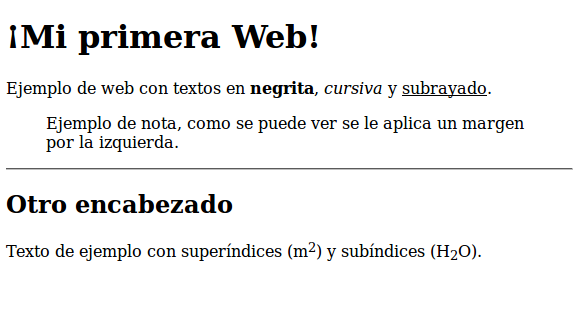

# Etiquetas básicas HTML

Dentro de la sección del cuerpo (`<body> ... </body>`) utilizaremos etiquetas HTML para crear el contenido _visual_ de la web. Estas etiquetas nos permitirán ir añadiendo textos, imágenes, encabezados, tablas, etc. para componer el diseño de la web. En primer lugar veremos las etiquetas más básicas que se suelen utilizar, estas son: 


* `<h1></h1>` a `<h6></h6>`: encabezados o títulos del documento con diferente relevancia, siendo `<h1>` la cabecera de mayor nivel.

* `<p></p>`: definición de un párrafo.

* `<br/>`: salto de línea.

* `<b></b>`: texto en negrita (etiqueta desaprobada. Se recomienda usar la etiqueta `<strong></strong>`).

* `<i></i>`: texto en cursiva (etiqueta desaprobada. Se recomienda usar la etiqueta `<em></em>`).

* `<s></s>`: texto tachado (etiqueta desaprobada. Se recomienda usar la etiqueta `<del></del>`).

* `<u></u>`: texto subrayado.

* `<center></center>`: texto centrado.

* `<pre></pre>`: texto preformateado, respeta los espacios y saltos de línea.

* `<sup></sup>`: Superíndice.

* `<sub></sub>`: Subíndice.

* `<blockquote></blockquote>`: Indica una cita textual, se representa como un párrafo indexado con respecto al margen.

* `<hr/>`: Línea horizontal, usada, por ejemplo, para separar diferentes secciones.

* `<!-- comentario -->`: Comentarios en HTML. El texto del comentario no será visible en el navegador.

* `<span></span>`: Esta etiqueta no aplica ningún formato por si misma, sino que provee una forma de definir un estilo o formato a un trozo de texto. Se utiliza junto con una hoja de estilo. Por ejemplo, lo podemos utilizar para marcar palabras en algún color o con algún formato especial.


A continuación se incluye un código de ejemplo en el que se ha ampliado el ejemplo del "Hola Mundo" y se han añadido algunas de las etiquetas HTML que hemos visto: 

```html
<!DOCTYPE HTML PUBLIC "-//W3C//DTD HTML 4.01//EN" "http://www.w3.org/TR/html4/strict.dtd">
<html>
<head>
    <title>Ejemplo</title>
    <meta charset="utf-8">
</head>
<body>
   <h1>¡Mi primera Web!</h1>
   
   <p>
        Ejemplo de web con textos en <strong>negrita</strong>, <em>cursiva</em> 
        y <u>subrayado</u>.
   </p>
   
   <blockquote>
        Ejemplo de nota, como se puede ver se le aplica un margen por la izquierda.
   </blockquote>
   
   <hr/>
   
   <!-- Este texto es un comentario que no se verá en el navegador!! -->
   
   <h2>Otro encabezado</h2>
   
   <p>
   		Texto de ejemplo con superíndices (m<sup>2</sup>) y subíndices (H<sub>2</sub>O).
   </p>
   
</body>
</html>
```

Si guardamos este código en un fichero con extensión "html" (por ejemplo "index.html") y lo abrimos se nos mostraría un resultado similar al siguiente:




