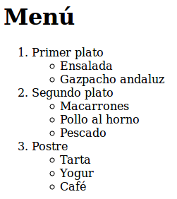

# Listas

Para definir una lista utilizamos las siguientes etiquetas:

* `<ol></ol>`: Lista ordenada (con numeración).
* `<ul></ul>`: Lista con puntos (o viñetas).

Las etiquetas `<ol></ol>` y `<ul></ul>` se utilizan como etiquetas contenedoras de los elementos de la lista, dentro de las cuales tendremos que utilizar la etiqueta `<li></li>` para ir añadiendo cada uno de los elementos de la misma. 

Por ejemplo, para crear una lista ordenada con dos elementos:

```html
<ol>
   <li>Elemento 1</li>
   <li>Elemento 2</li>
</ol>
```

Con lo que obtendríamos un resultado similar al siguiente:

1. Elemento 1
2. Elemento 2


O por ejemplo, para crear una lista con puntos o viñetas de tres elementos usaríamos el siguiente código:

```html
<ul>
   <li>Elemento 1</li>
   <li>Elemento 2</li>
   <li>Elemento 3</li>
</ul>
```

Con lo que obtendríamos un resultado similar al siguiente:

* Elemento 1
* Elemento 2
* Elemento 3


Dentro de las etiquetas `<li>` a su vez podemos usar otras etiquetas, como por ejemplo poner negritas, cursivas, encabezados, o cualquier otra cosa que se nos ocurra, por ejemplo: 

```html
<ul>
   <li><em>Elemento 1</em>: El elemento 1 es el <u>principal</u> de la lista.</li>
   <li><em>Elemento 2</em>: El elemento 2 es muy <strong>peligroso!</strong></li>
</ul>
```

Con este código HTML obtendríamos un resultado similar al siguiente:

* _Elemento 1_: El elemento 1 es el <u>principal</u> de la lista.
* _Elemento 2_: El elemento 2 es muy **peligroso!**


Dado que dentro de un elemento de la lista podemos poner cualquier otra etiqueta, también podremos poner otras listas. Esto nos permitirá es hacer listas anidadas de la forma: 

```html
<h1>Menú</h1>

<ol>
    <li>
        Primer plato
        <ul>
            <li>Ensalada</li>
            <li>Gazpacho andaluz</li>
       </ul>
    </li>
    <li>
        Segundo plato
        <ul>
            <li>Macarrones</li>
            <li>Pollo al horno</li>
            <li>Pescado</li>
        </ul>
    </li>
    <li>
        Postre
        <ul>
            <li>Tarta</li>
            <li>Yogur</li>
            <li>Café</li>
        </ul>
    </li>
</ol>
```

Con lo que obtendríamos una lista como la siguiente: 



